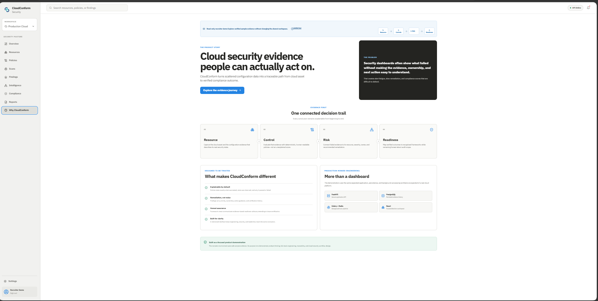
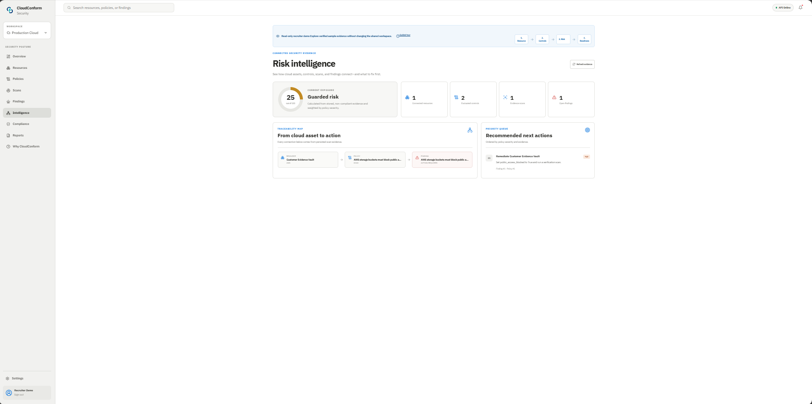
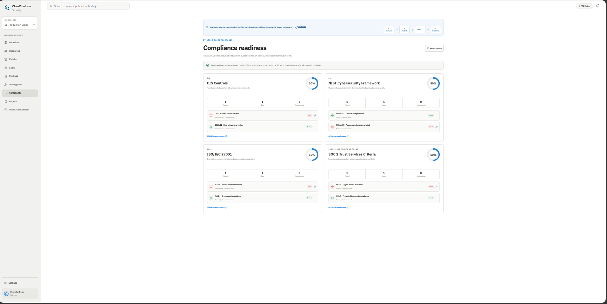
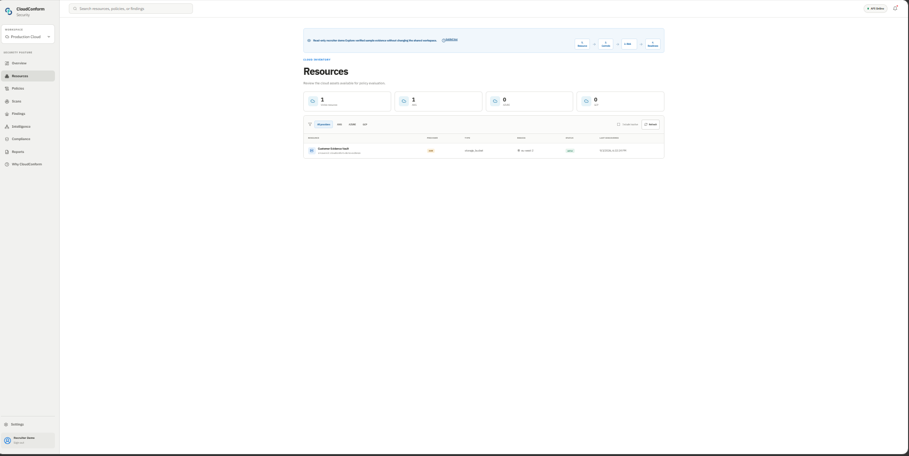
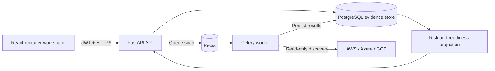

# CloudConform

[](https://cloudconform-demo.onrender.com)
[](https://github.com/Faithchinenye12/cloud-policy-checker/actions/workflows/ci.yml)

**An evidence-first cloud security and compliance platform that makes every result understandable, traceable, and actionable.**

CloudConform connects cloud inventory, deterministic policies, background scans,
findings, remediation, and compliance readiness in one decision trail. The live
recruiter environment is safe and read-only, includes representative evidence,
and requires no credentials.

> [Explore the live recruiter demo](https://cloudconform-demo.onrender.com) and
> follow **Resource → Control → Risk → Readiness**, or choose **Guided tour**.
> Render's free API can take a short moment to wake on the first visit; the
> interface reconnects automatically.

## Why CloudConform

Cloud-security dashboards can identify failures without making the underlying
evidence, ownership, or next action easy to understand. CloudConform is designed
around a clearer operational story:

1. **Resource** — preserve the asset configuration that establishes reality.
2. **Control** — evaluate it with an explicit, deterministic policy.
3. **Risk** — connect failed evidence to severity, ownership, and remediation.
4. **Readiness** — map verified outcomes to recognised security frameworks.

The result is not another unexplained score. A user can trace every conclusion
back to the resource, policy, scan, and stored result that produced it.

## Product highlights

- Multi-cloud inventory for AWS, Azure, and Google Cloud
- Opt-in storage discovery through official provider SDKs
- Explainable boolean policy rules and live configuration testing
- PostgreSQL-backed evidence from asynchronous Celery scans
- Finding ownership, deadlines, status, notes, and immutable transition history
- Deterministic risk prioritisation and resource-to-finding traceability
- Guided remediation followed by verification scanning
- Evidence-based CIS, NIST, ISO 27001, and SOC 2 readiness views
- CSV reporting and an intentionally read-only public demonstration
- Responsive React interface with a guided first-visit product journey

Framework mappings are product-authored crosswalks from deterministic technical
evidence. Readiness is decision support—not an audit, certification, or
endorsement by a framework publisher. Closing a workflow item does not raise a
score until a later scan records passing evidence.

## Product tour

### A product story, not just a feature list

The in-product narrative explains the security problem, the evidence-first
approach, and the engineering decisions behind the platform.

[](https://cloudconform-demo.onrender.com)

### Risk intelligence with a visible evidence trail

The intelligence workspace connects a resource to its evaluated policy,
resulting finding, exposure score, and recommended next action.

[](https://cloudconform-demo.onrender.com)

### Honest, evidence-based compliance readiness

Framework views distinguish passing evidence from gaps across CIS, NIST,
ISO/IEC 27001, and SOC 2 without presenting the result as certification.

[](https://cloudconform-demo.onrender.com)

### The cloud inventory behind every conclusion

The resource workspace preserves the provider, type, region, status, and last
discovery context used by deterministic controls.

[](https://cloudconform-demo.onrender.com)

## Architecture



The API owns inventory, policies, scans, findings, and remediation state. Redis
transports work; the Celery worker discovers and evaluates; PostgreSQL preserves
the evidence. Risk intelligence and readiness are projections of stored results
rather than separate sources of truth.

Read the detailed [architecture](docs/ARCHITECTURE.md),
[deployment guide](docs/DEPLOYMENT.md), and
[product and design vision](docs/DESIGN_VISION.md).

## Recruiter walkthrough

A useful five-minute review path is:

1. Open the [live demo](https://cloudconform-demo.onrender.com).
2. Choose **Guided tour** to follow the evidence journey.
3. Open **Intelligence** to inspect the traceability map and priority queue.
4. Open **Compliance** to compare passing evidence with unresolved gaps.
5. Open **Why CloudConform** for the product rationale and engineering story.

The public workspace contains sample evidence and blocks mutation controls. The
source repository also contains the full authenticated application and its real
API, worker, persistence, migration, and provider-integration paths.

## Run locally

Requirements: Docker Desktop and Docker Compose.

1. Copy `.env.example` to `.env` and set a unique `JWT_SECRET_KEY` of at least
   32 characters.
2. Start persistence and apply migrations:

   ```sh
   docker compose up -d postgres redis
   docker compose run --rm api alembic -c backend/alembic.ini upgrade head
   ```

3. Build and run the complete stack:

   ```sh
   docker compose up --build
   ```

4. Open <http://localhost:3000>. Interactive API documentation is available at
   <http://localhost:8000/docs>.

## Live cloud discovery

Discovery is disabled by default so local and public demonstrations remain safe
and deterministic. Enable only the provider configured privately:

- `AWS_DISCOVERY_ENABLED=true`
- `AZURE_DISCOVERY_ENABLED=true`
- `GCP_DISCOVERY_ENABLED=true`

Prefer IAM roles, workload identity, managed identity, or another short-lived
credential source supported by the provider SDK. Never commit `.env`, client
secrets, service-account keys, access tokens, or credential files.

## Quality checks

```sh
pytest -c backend/pytest.ini backend/tests
cd frontend && npm install && npm run build
docker build -t cloudconform-api .
docker build -f Dockerfile.worker -t cloudconform-worker .
docker build -t cloudconform-frontend frontend
```

GitHub Actions repeats backend tests, frontend compilation, security analysis,
and all three container builds on pushes and pull requests.

## Scope and limitations

CloudConform is a focused product demonstration, not a commercial CNAPP or an
auditing body. The current policy catalogue intentionally covers a small set of
storage controls; provider discovery is storage-focused; the public database is
ephemeral; and readiness mappings cover technical evidence rather than every
organisational or process control. Those boundaries are labelled so the demo
shows credible engineering without overstating assurance.

## Roadmap

- Expand the policy catalogue and provider resource coverage
- Add scheduled continuous scans and change-triggered evaluation
- Introduce organisation, workspace, and role-based access boundaries
- Add notification and ticketing integrations for remediation ownership
- Version policy-to-framework mappings and export fuller evidence packages
- Add end-to-end browser tests, observability, and production SLOs

## Design principle

CloudConform aims to prove that security depth and interface quality can
reinforce one another. Restrained visual design reduces cognitive load;
deterministic evaluation builds trust; and preserved evidence makes every
decision defensible. See [the full design story](docs/DESIGN_VISION.md).
