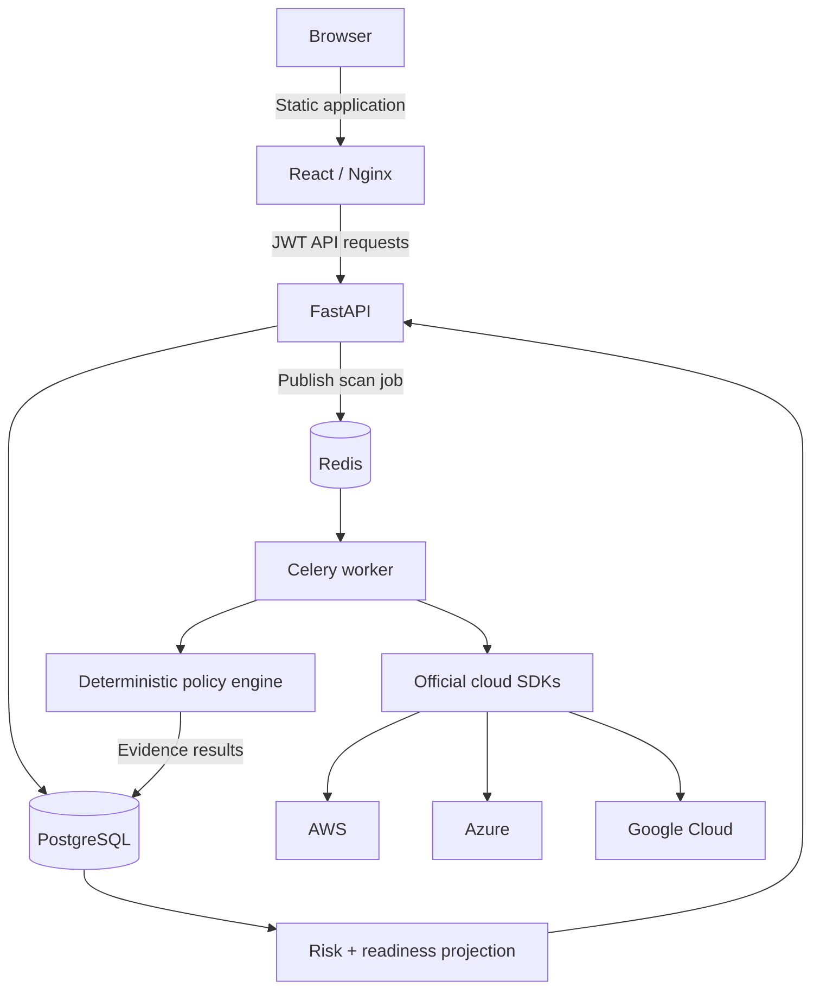

# Architecture

## System view

The browser authenticates with FastAPI and sends its JWT in the authorization
header. FastAPI owns inventory, policies, scans, and persisted compliance
results in PostgreSQL. Scan requests are queued through Redis and executed by a
Celery worker.

Before evaluation, an enabled provider adapter can refresh storage inventory
through the official AWS, Azure, or Google Cloud SDK. Discovery is read-only and
disabled by default. The deterministic rule engine then compares stored JSON
configuration with active policies. Failed results become traceable findings;
the Reports page summarises and exports that stored evidence.

The React application is compiled into static assets and served by Nginx, which
also proxies API requests. This separation allows the API, worker, and frontend
to scale independently while sharing one versioned contract.

## Policy intelligence projection

The Intelligence API projects existing compliance evidence into a connected
graph without creating a second source of truth. Resource, policy, scan, and
finding nodes retain their database identifiers. Typed edges explain which scan
evaluated a resource, which policy checked it, and which finding was produced.

Risk scoring is deterministic and capped at 100. Open findings contribute
points according to policy severity, and remediation guidance is derived from
the stored rule configuration. The Risk Intelligence workspace consumes this
projection to present exposure, traceability, and prioritized next actions.

## Remediation workflow

Each non-compliant result has an independent remediation lifecycle: open, in
progress, resolved, or risk accepted. A finding may be assigned to a user and
given a due date and working note. Every save appends an immutable transition
event with the actor, status movement, note, and timestamp.

Resolved and accepted findings remain connected to their original resource,
policy, and scan evidence, but no longer contribute to active risk scoring or
the priority action queue. Accepted risk requires a written justification.

## Trust boundaries

- The browser receives a JWT but never receives cloud-provider credentials.
- Provider discovery runs server-side and is disabled until explicitly enabled.
- Discovery reads configuration; remediation guidance does not mutate cloud
  infrastructure automatically.
- The API is the only application component that serves browser requests.
- Risk and readiness views derive from persisted scan results, preserving one
  evidence source of truth.

## Public demo boundary

The recruiter deployment seeds representative data and issues a restricted demo
identity. The frontend removes mutation controls for clarity, while the API
enforces read-only behaviour independently. The demo is therefore useful for
exploration without treating interface hiding as a security control.
